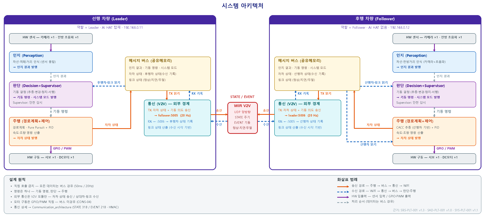
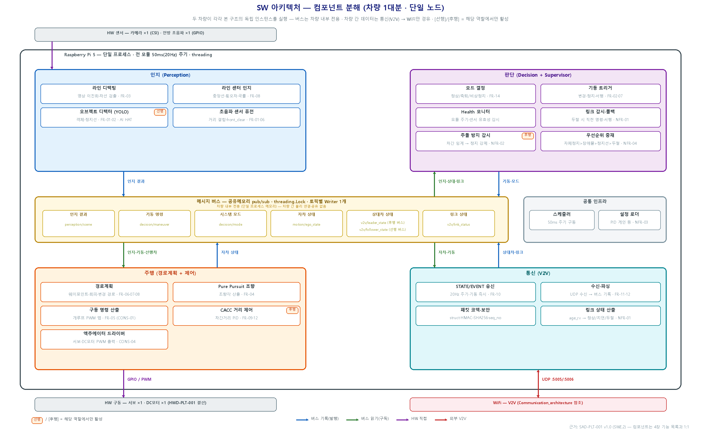
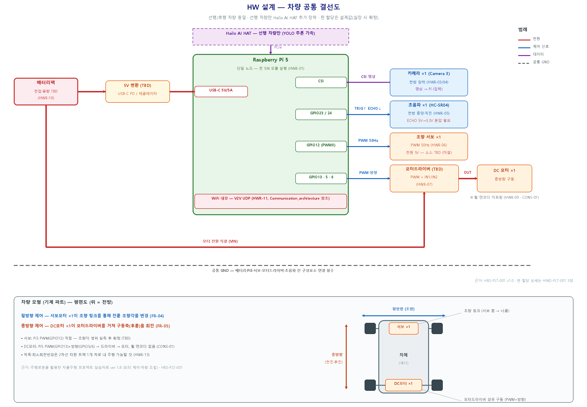
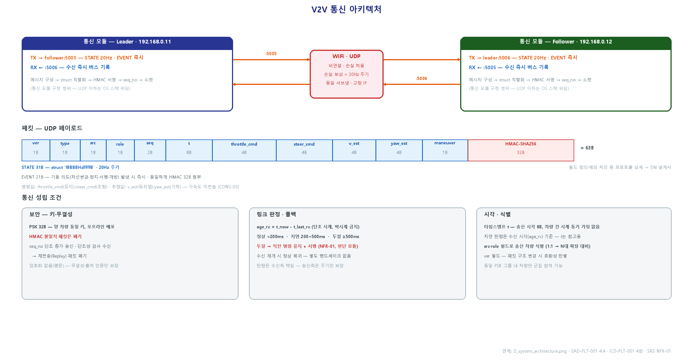

# IVS_Final — 군집주행(Platooning) V2V 자율주행 프로젝트

**HL 만도 & HL 클레무브 · IVS 5기 1조 Final 프로젝트**

🔗 **GitHub**: https://github.com/Heojiuk/IVS_Final

라즈베리파이 5 기반 소형 차량 2대로 **군집주행(Platooning)** 을 시연하는 프로젝트입니다.
선행 차량(Leader)은 카메라로 트랙 차선을 인식해 독립 자율주행하고, 후행 차량(Follower)은
WiFi **V2V(Vehicle-to-Vehicle)** 통신으로 선행 차량의 상태를 수신하여 차간거리를 유지하며 추종합니다.

본 저장소는 **ASPICE 프로세스에 따라 작성된 시스템·소프트웨어·하드웨어 설계 산출물**을 담고 있습니다.
(현재 단계: 요구사항·아키텍처·상세설계 완료 / 구현 착수 전 — [`src/`](src/) 비어 있음)

---

## 👥 팀 구성

| 역할 | 이름 |
|------|------|
| **팀장** | 허지욱 |
| **팀원** | 남궁수 · 박선호 · 오정환 · 윤승환 · 우솔휘 · 최주성 |

---

## 🎯 프로젝트 개요

2대의 자율주행 로봇이 무선 통신으로 편대를 이루어 주행하며, 다음 시나리오를 규정된 동작으로 수행합니다.

| No. | 시나리오 | 설명 |
|-----|----------|------|
| S-1 | 군집 형성·지속 주행 | 정렬된 2대가 출발해 선행-후행 편대를 유지하며 타원형 트랙을 지속 주행 |
| S-2 | V2V 기반 추종 | 후행 차량이 선행 차량의 구동·조향 상태를 수신하여 차간거리 유지 추종 |
| S-3 | 전방 장애물 회피 | 장애물 감지 시 회피하거나 안전 정지 (**자체 정지 최우선**) |
| S-4 | 횡단보도(정지선) 앞 정지 | 정지선 인식 시 정지, 통과 조건 충족 시 재출발 |
| S-5 (선택) | 차선 변경 | 필요 시 인접 차선으로 변경 |

**주행 환경** — 1200 × 1200 mm 흰색 아크릴 보드 위, 검은색 테이프로 구성한 **2차선 타원형 루프 트랙**
(실선=외곽·좌우 차선 / 점선=차로 경계선 / 가로선=정지선)

---

## 🚗 시스템 구성

| 구분 | 선행 차량 (Leader) | 후행 차량 (Follower) |
|------|-------------------|---------------------|
| 컴퓨팅 | Raspberry Pi 5 | Raspberry Pi 5 |
| AI 가속 | **Hailo AI HAT** (YOLO 추론) | 없음 |
| 카메라 | Raspberry Pi Camera 3 × 1 | Raspberry Pi Camera 3 × 1 |
| 거리 센서 | 전방 초음파(HC-SR04) × 1 | 전방 초음파(HC-SR04) × 1 |
| 조향 | 서보모터 × 1 | 서보모터 × 1 |
| 구동 | DC 모터 + 모터드라이버 + 배터리팩 | DC 모터 + 모터드라이버 + 배터리팩 |
| 통신 | WiFi UDP 송수신 (`192.168.0.11`) | WiFi UDP 송수신 (`192.168.0.12`) |

두 차량의 하드웨어 구성은 **AI HAT을 제외하면 동일**합니다.
액추에이터는 Raspberry Pi 5의 **GPIO/PWM으로 직접 구동**하며, 별도 MCU(Arduino)·CAN 계층과 휠 엔코더는 포함하지 않습니다.

---

## 🏗️ 시스템 아키텍처

모든 모듈은 단일 Raspberry Pi 5 노드의 **단일 프로세스 위에서 50ms(20Hz) 고정 주기**로 동작하며,
모듈 간 데이터는 **공유메모리 pub/sub 메시지 버스**만을 경유합니다(직접 호출 금지).



### 4개 소프트웨어 모듈

| 모듈 | 주요 책임 |
|------|-----------|
| **인지 (Perception)** | 차선 검출·중앙 인지, 카메라+초음파 융합 전방 객체 검출, (선행) YOLO 객체·정지선 인식 |
| **판단 (Decision + Supervisor)** | 동작 모드 결정·전환, 기동 트리거(변경·정지·서행), health·통신 감시, 안전 우선순위 중재 |
| **주행 (경로계획 + 제어)** | 차체 기준 웨이포인트 생성 + Pure Pursuit·PID 추종, (후행) CACC 차간거리 유지, GPIO/PWM 직접 구동 |
| **통신 (V2V)** | WiFi UDP 양방향 송수신, 패킷 조립·파싱, 링크 상태 산출 |



### 설계 원칙

- 모듈 간 직접 호출 금지 — 모든 데이터는 메시지 버스(공유메모리) 경유, 50ms 주기
- 명령 경로는 하나 — 기동 명령(`decision/maneuver`), 판단 → 주행
- 외부 경계를 넘는 모듈은 **통신(V2V)이 유일**
- 모터 구동은 GPIO/PWM 직접 — 버스 미경유 (CONS-04)
- 튜닝 파라미터(PID 게인·조향 오프셋 등)는 외부 설정 파일(`config.yaml`)로 관리 (NFR-03)

---

## 🔌 하드웨어 설계 (핀 할당)



| 기능 | Raspberry Pi 5 핀 | 연결 대상 | 비고 |
|------|------------------|-----------|------|
| 카메라 | CSI 포트 | Raspberry Pi Camera 3 | 전방 장착 |
| 초음파 TRIG / ECHO | GPIO23 / GPIO24 | HC-SR04 | ECHO는 5V→3.3V **분압 필수** |
| 조향 서보 | GPIO12 (PWM0) | 서보 신호선 | 50Hz 하드웨어 PWM |
| 모터 속도 | GPIO13 (PWM1) | 모터드라이버 EN | 듀티 = 구동 명령(개루프) |
| 모터 방향 | GPIO5 · GPIO6 | 모터드라이버 IN1/IN2 | 전진·후진·정지 |
| AI 가속 | PCIe | Hailo AI HAT | **선행 차량만** |
| V2V 통신 | 내장 WiFi | 상대 차량 | UDP |

> 핀 할당은 설계값이며 실장 시 확정합니다. 모터 전원은 컴퓨팅 레일과 분리하여 노이즈·전압 강하를 차단합니다.

---

## 📡 V2V 통신 프로토콜

WiFi **UDP**로 차량 간 양방향 통신을 수행합니다. 교환 데이터는 측정 운동상태가 아니라 **명령·의도와 추정값**입니다(CONS-05).



- **포트**: 선행 → `follower:5005`, 후행 → `leader:5006`
- **STATE 패킷** (31B + HMAC 32B = **63B**) — `struct '!BBBBHdffffB'`, **20Hz** 주기 송신
  필드: `ver·type·src·role·seq·t · throttle_cmd · steer_cmd · v_est · yaw_est · maneuver`
- **EVENT 패킷** (21B + HMAC 32B) — 기동 의도(차선변경·정지·서행·개방) 발생 시 **즉시** 송신
- **보안**: HMAC-SHA256 (사전 공유 키 PSK 32B, 양 차량 동일·오프라인 배포), `seq` 단조 증가 검증 → 위·변조·재전송 패킷 폐기
- **링크 판정** (수신 공백 `age_rx` 기준): 정상 `<200ms` / 지연 `200~500ms` / 두절 `≥500ms`

---

## 🛡️ 동작 모드 및 안전

| 모드 | 진입 조건 | 동작 |
|------|-----------|------|
| **정상** | 전 모듈 health 정상 · 링크 정상/지연 | 시나리오 주행 |
| **축퇴** | 링크 두절(≥500ms) 또는 차선 미검출 | 직전 명령 유지 + 서행, 재연결·재검출 시도 (NFR-01) |
| **비상정지(ESTOP)** | 자체 정지 트리거(전방 임계 거리 이하, health 이상 등) | 즉시 정지 — 최우선 (SG-03) |

**안전 동작 우선순위 (NFR-04)** — `자체 정지 > 전방 장애물 > 정지선 정지 > 통신 두절`

**안전 목표(Safety Goals)**: 추돌 0건(SG-01) · 두절 시 2초 이내 재연결/안전 전환(SG-02) · 자체 안전 정지(SG-03) · 동작 우선순위 준수(SG-04)

---

## ⚙️ 핵심 설계 제약 (Constraints)

하드웨어 구성에서 비롯되어 모든 설계의 전제가 되는 제약입니다.

| ID | 제약 내용 |
|----|-----------|
| **CONS-01** | 휠 엔코더가 없어 실제 속도(v_ego) 측정 불가 → 종방향 속도 폐루프 구현 불가 |
| **CONS-02** | 차량 위치는 차체 기준 상대 정보(횡오차·헤딩)만 사용, 전역좌표 미사용 |
| **CONS-03** | 전방 초음파 1개·직진 방향만 측정 → 곡선 구간에서 선행 차량 일시 미감지 가능 |
| **CONS-04** | 액추에이터는 Pi 5 GPIO로 직접 구동, 별도 MCU·CAN 계층 미포함 |
| **CONS-05** | 운동상태(속도·가속도·요레이트) 측정 센서 없음 → 횡방향=카메라 폐루프, 종방향 추종(후행)=초음파 폐루프, 종방향 선행=개루프 듀티. V2V 교환값은 명령·의도·추정값 기준 |

---

## 📚 문서 체계 (ASPICE 산출물)

요구사항이 시스템 → 소프트웨어/하드웨어로 분해되며, **양방향 추적성**을 유지하는 V-모델 문서 계층입니다.

```
이해관계자 요구사항 (발표자료)
        │
        ▼
SYS-PLT-001  시스템 요구사항 명세서 ──────────┐ (SyR-01~12)
        │                                      │
   ┌────┴─────┐                                │
   ▼          ▼                                ▼
SRS-PLT-001   HRS-PLT-001              [시스템 제약 CONS-01~05]
SW 요구사항    HW 요구사항
(FR-01~14,     (HWR-01~13,
 NFR-01~04)     HPR-01~02)
   │            │
   ▼            ▼
SAD-PLT-001   HWD-PLT-001
SW 아키텍처    HW 설계서
   │
   ▼
ICD-PLT-001   인터페이스 명세서 (버스 토픽 7종 + V2V 패킷 + HW 신호)
   │
   ▼
SDD-PLT-001   SW 상세설계서 (19개 컴포넌트)
```

| 문서 | 제목 | 버전 | ASPICE 프로세스 |
|------|------|------|------|
| [SYS-PLT-001](docs/SYS-PLT-001_시스템요구사항명세서_v1.1.docx) | 시스템 요구사항 명세서 | v1.1 | SYS.2 |
| [SRS-PLT-001](docs/SRS-PLT-001_SW요구사항명세서_v1_3.docx) | SW 요구사항 명세서 | v1.3 | SWE.1 |
| [SAD-PLT-001](docs/SAD-PLT-001_SW아키텍처설계서_v1.0.docx) | SW 아키텍처 설계서 | v1.0 | SWE.2 |
| [ICD-PLT-001](docs/ICD-PLT-001_인터페이스명세서_v1.0.docx) | 인터페이스 명세서 | v1.0 | SWE.2 (IF 정의) |
| [SDD-PLT-001](docs/SDD-PLT-001_SW상세설계서_v1.0.docx) | SW 상세설계서 | v1.0 | SWE.3 |
| [HRS-PLT-001](docs/HRS-PLT-001_HW요구사항명세서_v1.0.docx) | HW 요구사항 명세서 | v1.0 | HWE.1 |
| [HWD-PLT-001](docs/HWD-PLT-001_HW설계서_v1.0.docx) | HW 설계서 | v1.0 | HWE.2 |

> 구버전·폐기 산출물은 [`docs/old/`](docs/old/) 에 보관되어 있습니다.
> (MDS-PLT-001 모듈스펙명세서는 SAD-PLT-001로 흡수·대체, SRS v1.2·SYS v1.0은 상위 버전으로 대체)

---

## 📂 저장소 구조

```
IVS_Final/
├── README.md
├── CLAUDE.md                         # 작업 가이드라인
├── docs/
│   ├── SYS-PLT-001_시스템요구사항명세서_v1.1.docx
│   ├── SRS-PLT-001_SW요구사항명세서_v1_3.docx
│   ├── SAD-PLT-001_SW아키텍처설계서_v1.0.docx
│   ├── SDD-PLT-001_SW상세설계서_v1.0.docx
│   ├── ICD-PLT-001_인터페이스명세서_v1.0.docx
│   ├── HRS-PLT-001_HW요구사항명세서_v1.0.docx
│   ├── HWD-PLT-001_HW설계서_v1.0.docx
│   ├── 설계/                          # 아키텍처 다이어그램 (PNG)
│   │   ├── D_system_architecture.png
│   │   ├── SW_architecture.png
│   │   ├── HW_design.png
│   │   └── Communication_architecture.png
│   ├── 회의및발표/                    # 군집주행 컨셉 발표자료 (pptx/pdf)
│   └── old/                           # 폐기·구버전 산출물
└── src/                              # 구현 코드 (착수 전)
```

---

## 🗺️ 로드맵

- [x] 시스템 요구사항 분석 (SYS.2)
- [x] SW / HW 요구사항 명세 (SWE.1 / HWE.1)
- [x] SW 아키텍처 · HW 설계 (SWE.2 / HWE.2)
- [x] 인터페이스 명세 · SW 상세설계 (ICD / SWE.3)
- [ ] 차량 실측 후 TBD 파라미터 확정 (조향각·차간거리·감지 거리·듀티맵 등)
- [ ] 단위 구현 및 검증 (SWE.4)
- [ ] 통합 및 시연 (SWE.5)
