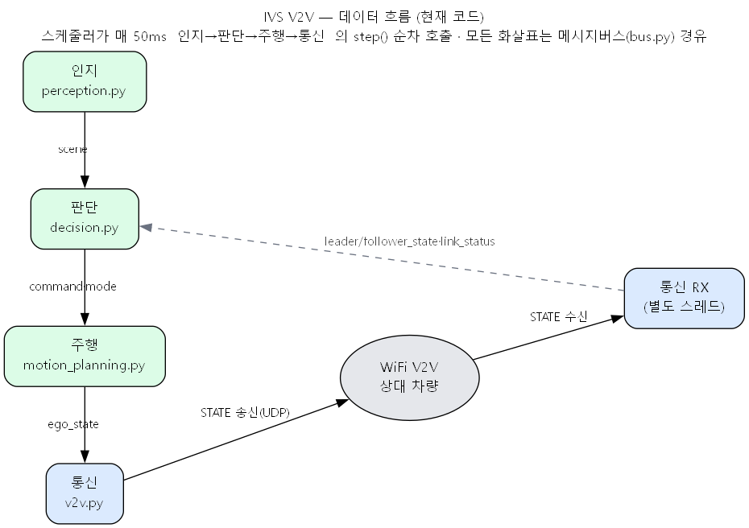
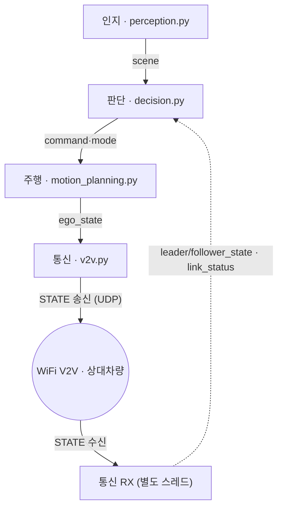

# 현재 코드 구조 (py) — 데이터 흐름

스케줄러가 매 50ms `인지 → 판단 → 주행 → 통신` 의 `step()`을 순서대로 호출. **모든 화살표는 메시지버스(`bus.py`) 경유** (모듈끼리 직접 호출 없음). 통신 수신(RX)은 별도 스레드.

편집용 mermaid 소스 (GitHub 자동 렌더):

- **정방향**: 인지 → 판단 → 주행 → 통신 (scene → command·mode → ego_state → STATE)
- **피드백(점선)**: 통신 RX가 받은 상대차 상태·링크상태를 판단으로
- **생략된 read**: 주행도 `scene`·`leader_state`, 판단도 `link_status` 를 함께 read (모두 버스 경유)
- **지원 파일**: `main.py`(조립·기동) · `scheduler.py`(50ms 루프) · `config.py`(설정) · `messages.py`(데이터 타입)
